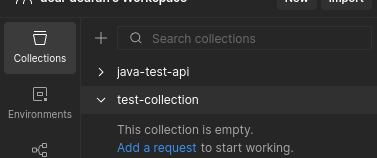

# Installation Guide for SPRINGBOOT

| 111          | 222        | 333        | 444        | JAVA                           |
| ------------ | ---------- | ---------- | ---------- | ------------------------------ |
| **v20.19.4** | **10.8.2** | **0.40.1** | **20.0.0** | **openjdk 17.0.16 2025-07-15** |

### 1. JAVA and Maven Installation

- Java installation

```bash
# Update the system
  sudo apt update

# Install JDK
  sudo apt install default-jdk

# Install specific JDK
  sudo apt install openjdk-17-jdk

# Checking if the java is installed
  java -version
```

- Maven installation

```bash
# Update the system
  sudo apt update

# Maven installation
  sudo apt install maven -y

# Check if the maven is installed
  mvn -version
```

### 2. Database Installation

- Login to your Local / Virtual Machine

```bash
# Install MySQL Server from package manager
sudo apt install mysql-server

# Setup the MySQL Permission and Owner
sudo chmod 700 /var/lib/mysql && sudo chown -R mysql:mysql /var/lib/mysql

# Restart webserver and check the version of php
sudo systemctl start mysql && sudo systemctl enable mysql && sudo systemctl status mysql
```

### 3. Database Credential

- Using the command below will enter the mysql command line interface. Hit **"Enter"** when asking for password. (No Default Password).

```bash
# Leave blank when asking for password
sudo mysql -u root -p
```

- Change the database password for **"root"** User.

```sql
-- Alter USER Table
ALTER USER 'root'@'localhost' IDENTIFIED WITH mysql_native_password BY 'P@ssw0rd01';

-- Set the Permission
SHOW GRANTS FOR 'root'@'localhost';

-- Apply the changes
FLUSH PRIVILEGES;

-- Create Database
CREATE DATABASE wordpress;

-- Check if database exist
SHOW databases;

-- Use Database
USE wordpress;

-- Exit to bash
exit
```

### 4. Workbench installation in Ubuntu Desktop

- Open this link (https://dev.mysql.com/downloads/workbench/) to download the package

```bash
# Go to the folder location of the downloaded package EX. downloads
  cd Downloads

# look for the package name
  ls

# installation
  sudo apt install ./mysql-workbench-community_8.0.44-1ubuntu24.04_amd64.deb
```

### 5. Postman installation and creation of collection and environment and how to use baseURL

```bash
# Installation in terminal (Ubuntu desktop)
  sudo snap install postman

# You can launch the post man in your app menu

# Creating collection 
  Select the collections menu in top-right of the window
  Click the plus sign next to the collections menu

  
```


